# :baby_bottle: Hey PaPa

> Hey PaPa는 아기아빠를 위한 서비스로 육아와 출산에 관한 정보를 제공하고 아빠들만의 커뮤니티를 만들어서 소통할 수 있습니다.

### 기획 배경 및 기대효과

- 남성의 육아 휴직률 및 육아 참여 증가
- 임식놔 출산을 위한 예비아빠만의 정보 제공
- 아빠들을 위한 커뮤니티 활성화

### 목차

- [팀원소개](#baby_bottle-팀원-소개)
- [주요 기능](#baby_bottle-주요-기능)
- [개발 환경](#baby_bottle-개발-환경)
- [참고](#baby_bottle-참고)

<br>

# :baby_bottle: 팀원 소개

|                                                 천수승                                                  |                                노효진                                 |                                박선주                                 |                                송지연                                 |                                조효정                                 |
| :-----------------------------------------------------------------------------------------------------: | :-------------------------------------------------------------------: | :-------------------------------------------------------------------: | :-------------------------------------------------------------------: | :-------------------------------------------------------------------: |
|  |  |  |  | 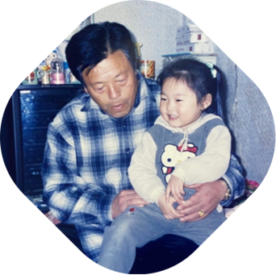 |
|                                        Project Leader & Frontend                                        |                                Backend                                |                               Frontend                                |                            CI/CD & Backend                            |                            CI/CD & Backend                            |
|                                          cheonss2357@gmail.com                                          |                           23gywls@naver.com                           |                          vnemxmcjr@gmail.com                          |                         6loutlside@naver.com                          |                         whgywjd6794@gmail.com                         |

<br>

# :baby_bottle: ​주요 기능

> ### 1. 회원가입

| 1-1. 회원 가입                          | 1-2. 아기 태명과 생년월일(출산 예정일), <br />임신 주차를 입력 할 수 있습니다. |
| --------------------------------------- | ------------------------------------------------------------------------------ |
| 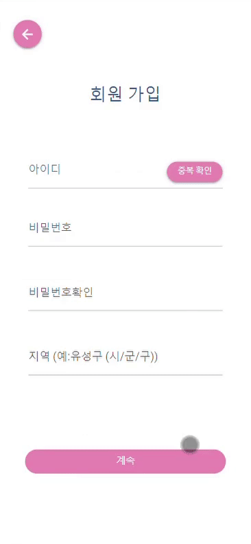 | 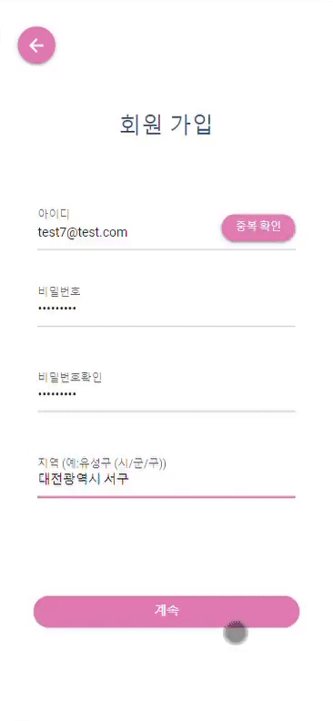                                        |

> ### 2. 로그인 및 홈 화면

| 2-1. 로그인 후 홈 화면에서는 다른 아빠들이 쓴 글들을 볼 수 있습니다. |
| -------------------------------------------------------------------- |
|                               |

> ### 3. 게시글 좋아요 & 댓글

| 3-1. 게시글을 누르면 댓글들을 볼 수 있고 좋아요와 댓글도 남길 수 있습니다. |
| -------------------------------------------------------------------------- |
| 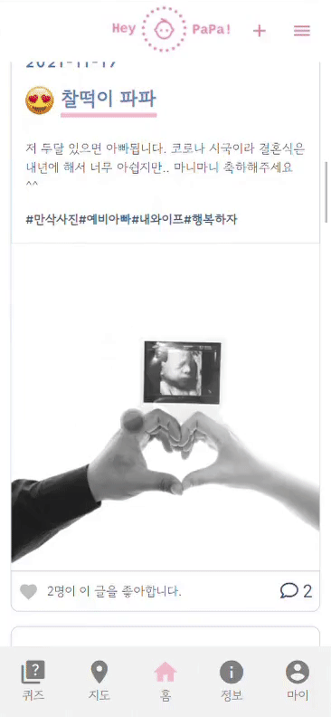                                |

> ### 4. 게시글 작성

| 4-1. 우측 + 버튼을 통해 게시글을 작성할 수 있습니다. |
| ---------------------------------------------------- |
| 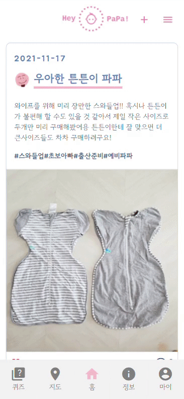  |

> ### 5. 퀴즈 풀기 & 댓글

| 5-1. 퀴즈는 4가지 카테고리가 있고 <br />문제를 풀면 정답인지 오답인지 알 수 있습니다. | 5-2. 문제를 찜하여 저장할 수 있고 <br />다른 아빠들의 반응도 볼 수 있습니다. |
| ------------------------------------------------------------------------------------- | ---------------------------------------------------------------------------- |
|                                        |                                       |

> ### 6. 마이페이지

| 6-1. 내가 작성한 글, 좋아요한 글, <br />찜한 문제를 한 눈에 볼 수 있습니다. | 6-2. 프로필 사진을 눌러 변경도 할 수 있습니다.          |
| --------------------------------------------------------------------------- | ------------------------------------------------------- |
| 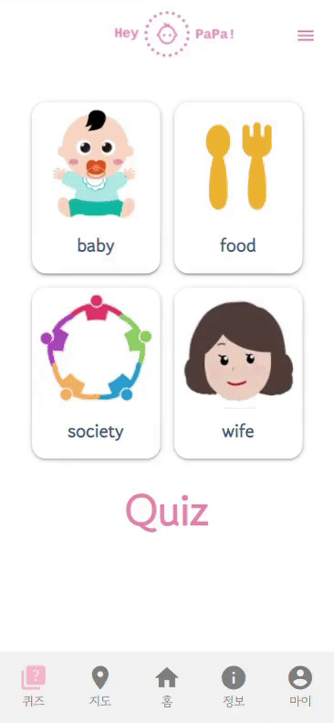                                 | 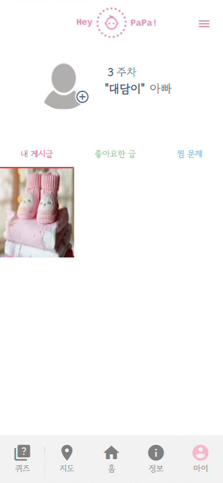 |

> ### 7. 회원 정보 수정 & 로그아웃

| 7-1. 우측 상단 메뉴 버튼에서 회원 정보 수정과 로그아웃을 할 수 있습니다. |
| ------------------------------------------------------------------------ |
| 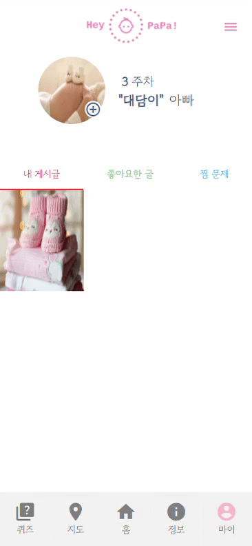                      |

> ### 8. 지도

| 8-1. 내 위치 기반으로 주변 산후조리원 정보를 볼 수 있습니다. |
| ------------------------------------------------------------ |
| 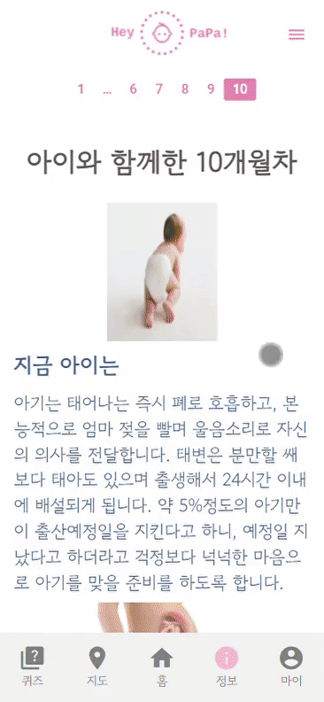                              |

> ### 9. 정보

| 9-1. 10달 동안 아기와 산모의 상태 변화를 알 수 있습니다. |
| -------------------------------------------------------- |
| 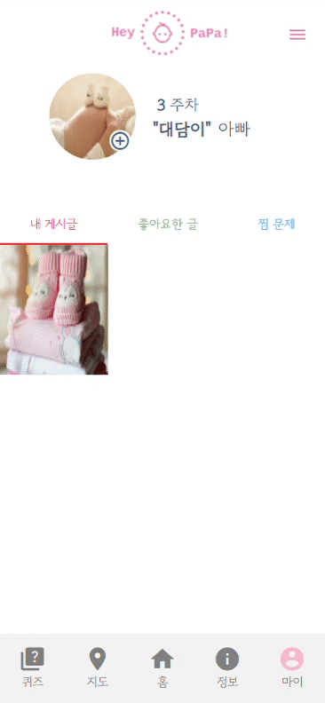                |

<br>

# :baby_bottle: ​개발 환경

### Frontend

- Framework

  - Vue.js
  - Quasar

- 설치 및 실행

```
$ npm install
$ npm install -g @quasar/cli
$ npm install -g @vue/cli

$ quasar dev
```

### Backend

- Framework
  - Spring boot
- DB
  - MySQL / Redis

### Collaboration

- Jira / Mattermost
- Discord
- Notion

<br>

# :baby_bottle: ​참고

### 아키텍쳐

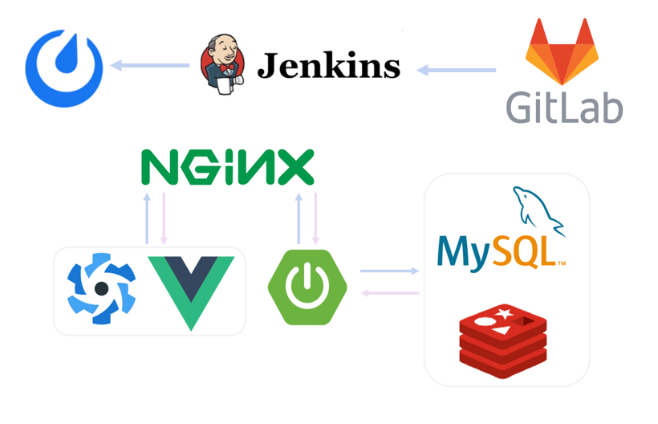

### 기타 문서

- [와이어프레임](https://www.figma.com/file/g1y23MXOT1rwSPikhTqCKP/HeyPapa-team-library?node-id=0%3A1)
- [Notion](https://productive-telescope-f0d.notion.site/96-22a595de09544591a88b0cc309232b6e)
- [ERD](https://www.erdcloud.com/d/Zex75zDjZD24YrSBF)

### 참고 자료

- https://www.maeili.com/search/searchInfo.do
